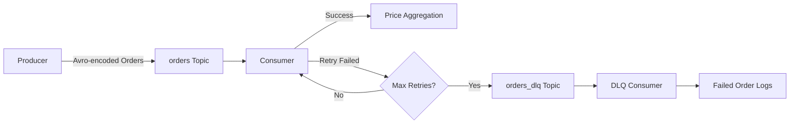

# Kafka Order Processing System

A robust Kafka-based order processing pipeline demonstrating real-time event streaming, Avro serialization, retry mechanisms, and Dead Letter Queue (DLQ) pattern implementation using Python.

## Overview

This project implements a complete event-driven architecture for processing orders with the following components:

- **Producer**: Generates random order events and publishes them to Kafka using Avro serialization
- **Consumer**: Processes orders with retry logic, calculates running price averages, and handles failures
- **DLQ Consumer**: Monitors and logs failed messages for inspection and potential reprocessing
- **Infrastructure**: Dockerized Kafka and Zookeeper setup for easy deployment

## Architecture



### Key Features

-  **Avro Schema Evolution**: Type-safe message serialization using Apache Avro
-  **Retry Logic**: Configurable retry attempts (default: 3) with exponential backoff
-  **Dead Letter Queue**: Automatic routing of failed messages for later analysis
-  **Real-time Aggregation**: Running average calculation of order prices
-  **Docker Compose**: One-command infrastructure setup
-  **Error Handling**: Comprehensive exception handling and logging

##  Project Structure

```
.
├── docker-compose.yml          # Kafka & Zookeeper orchestration
├── schemas/
│   └── order.avsc             # Avro schema definition
├── producer/
│   └── producer.py            # Order event producer
├── consumer/
│   └── consumer.py            # Main consumer with retry & DLQ logic
└── dlq_consumer/
    └── dlq_consumer.py        # Dead Letter Queue consumer
```

##  Getting Started

### Prerequisites

- **Docker** and **Docker Compose** installed
- **Python 3.8+**
- **pip** package manager

### Installation

1. **Clone the repository**
   ```bash
   git clone <repository-url>
   cd Nadun-Dissanayake-kafka-order-processing-system
   ```

2. **Install Python dependencies**
   ```bash
   pip install confluent-kafka fastavro
   ```

3. **Start Kafka infrastructure**
   ```bash
   docker-compose up -d
   ```

4. **Verify Kafka is running**
   ```bash
   docker-compose ps
   ```

##  Usage

### Running the Producer

The producer generates random orders every second and publishes them to the `orders` topic:

```bash
python producer/producer.py
```

**Sample Output:**
```
Producer started (Ctrl+C to stop)…
Produced: {'orderId': 'a1b2c3d4-...', 'product': 'item3', 'price': 45.67}
Delivered to orders [0]
```

### Running the Consumer

The consumer processes orders, calculates running averages, and handles failures:

```bash
python consumer/consumer.py
```

**Sample Output:**
```
Consumer started…
Processed a1b2c3d4-... | price=45.67 | avg=45.67
Attempt 1/3 failed: Simulated error: high price
Attempt 2/3 failed: Simulated error: high price
Attempt 3/3 failed: Simulated error: high price
DLQ: e5f6g7h8-... -> Simulated error: high price
```

### Running the DLQ Consumer

Monitor failed messages in the Dead Letter Queue:

```bash
python dlq_consumer/dlq_consumer.py
```

**Sample Output:**
```
DLQ consumer started…

--- DLQ EVENT ---
{
  "failed_order": {
    "orderId": "e5f6g7h8-...",
    "product": "item1",
    "price": 125.50
  },
  "reason": "Simulated error: high price"
}
```

##  Data Schema

### Order Schema (Avro)

```json
{
  "type": "record",
  "name": "Order",
  "namespace": "com.assignment",
  "fields": [
    { "name": "orderId", "type": "string" },
    { "name": "product", "type": "string" },
    { "name": "price", "type": "float" }
  ]
}
```

### DLQ Message Format (JSON)

```json
{
  "failed_order": {
    "orderId": "string",
    "product": "string",
    "price": float
  },
  "reason": "string"
}
```

### Failure Condition

Current implementation fails orders with price > 100. Customize in `consumer/consumer.py`:

```python
def fail_condition(order):
    return order["price"] > 100
```

## Docker Compose Configuration

The `docker-compose.yml` sets up:

- **Zookeeper** (port 2181): Kafka cluster coordination
- **Kafka Broker** (port 9092): Message broker

```yaml
version: '3.8'
services:
  zookeeper:
    image: confluentinc/cp-zookeeper:7.6.0
    environment:
      ZOOKEEPER_CLIENT_PORT: 2181
      ZOOKEEPER_TICK_TIME: 2000

  kafka:
    image: confluentinc/cp-kafka:7.6.0
    depends_on:
      - zookeeper
    ports:
      - "9092:9092"
    environment:
      KAFKA_BROKER_ID: 1
      KAFKA_ZOOKEEPER_CONNECT: zookeeper:2181
      KAFKA_ADVERTISED_LISTENERS: PLAINTEXT://localhost:9092
```


### Expected Behavior

- **Successful orders**: Processed immediately, contribute to running average
- **Failed orders**: Retry 3 times with 1-second delay, then sent to DLQ
- **DLQ messages**: Logged with original order data and failure reason


### View Consumer Group Offsets

```bash
docker exec -it <kafka-container-id> kafka-consumer-groups --bootstrap-server localhost:9092 --describe --group order-group
```


## 📚 Technologies Used

- **Apache Kafka**: Distributed event streaming platform
- **Apache Avro**: Data serialization framework
- **Python 3**: Programming language
- **confluent-kafka-python**: Kafka client library
- **fastavro**: Fast Avro implementation
- **Docker & Docker Compose**: Containerization

## 👤 Author

**Nadun Dissanayake**

---

## 📖 Additional Resources

- [Apache Kafka Documentation](https://kafka.apache.org/documentation/)
- [Confluent Kafka Python](https://docs.confluent.io/kafka-clients/python/current/overview.html)
- [Apache Avro Specification](https://avro.apache.org/docs/current/spec.html)
- [Dead Letter Queue Pattern](https://www.enterpriseintegrationpatterns.com/patterns/messaging/DeadLetterChannel.html)
